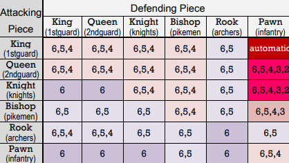

## Fuzzy-Logic Medieval Chess Game
### A Chess Variation of Medival Warfare Corp Command Structure

The **Corp Command F-L Medieval Chess Game** variant is a corp structure game where each team is broken up into 
three corp each with their own commanders. These armies follow the following rules:
 
>- The **King** and **Bishop** are corp commanders, each with one command authority that can be used each turn.
>- Up to three Corp Command actions may be taken in each turn, one by each Corp. Corp command Actions **ARE NOT** required in any given turn.
>- Command Authority may not be transferred from one commander to another. 
>- The Kings Bishop commands the three pawns left of the Kings Pawn and the Kings Knight.
>- The Queens Bishop commands the three pawns right of the Queens Pawn and the Queens Knight.
>- The King commands the king and queen pawn, the Queen and the two Rooks. 
>- The King may delegat any of its pieces to be commnanded by either Bishop, at any time.
>- When a Bishop is captured, its command pieces revert to the command of the King, but the command authority is lost. 
>- The game ends similar to that of normal chess, When the King is captured. 

### Capturing Pieces:
In this game, the normal implementation of capturing any piece that is attacked is changed to add some uncertainty to each 
action. The Attacking player must roll a dice to determine if a capture is successful. The die roll needed to capture a piece
depends on the combination of the attacking piece  and the defending piece shown in the table below. When the attack is 
successful, the attacking piece will move to the captured piece destination, if the attack is unsuccessful however; the piece
will remain in its original location. 
 
 

 
 

*Current Version: 1.1.0*

